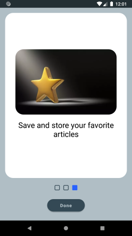
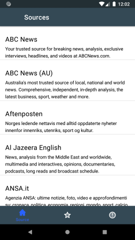
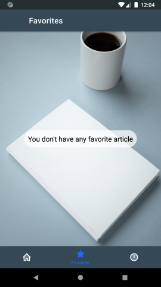
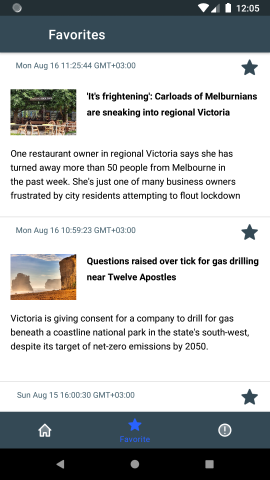
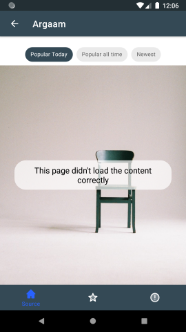

# API KEY require:
Require API KEY in order to run this app. Key is available in https://newsapi.org/ . Inside base directory of project create new file named "key.properties" that contains following line: API_KEY = "paste your API KEY here".

# Technical description:
* [MVVM pattern](https://developer.android.com/jetpack/guide#overview) used for app architecture.
* [DDD pattern](https://proandroiddev.com/the-real-repository-pattern-in-android-efba8662b754) used for repository.
* RxJava3 is used for data communication between architectural parts.
* Multithreating: @Main for UI, @IO for repository.
* Hilt DI gives reusability of code, reduces the boilerplate code, ease of refacotring and testing.
* Retrofit2 in conjunction with REST API for fetching data.
* ROOM DAO for caching data.
* Live Data for communication between ViewModel and UI.
* Multi Back Staks solution
* and many more...

# Features:
*	Splash scree
*	Tutorial scree
*	Main screen with ViewPager2 and bottom navigation
*	Sources screen, Articles screen, Article details screen
*	Favorites screen
*	Screen display state
*	All data cached in local memory
*	Save/delete favorites
*	Animation between fragments transition
*	Error message handling

# Screens:

